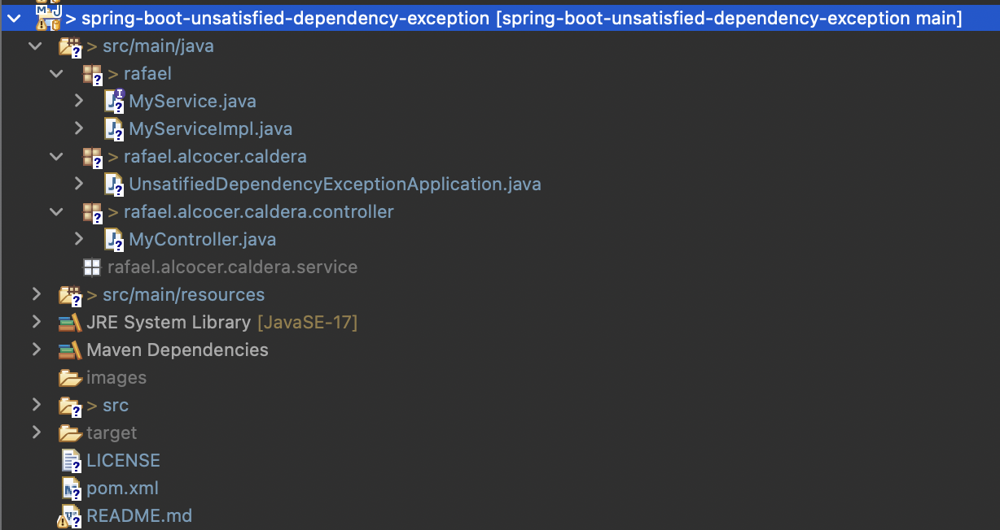
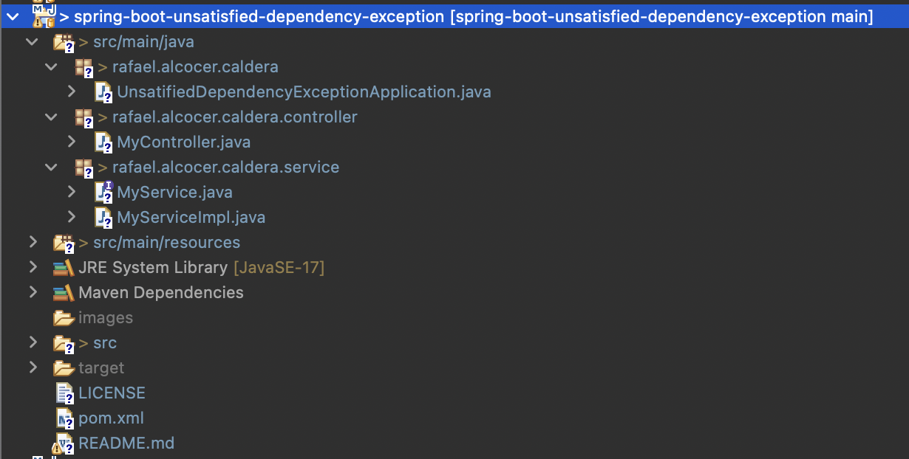
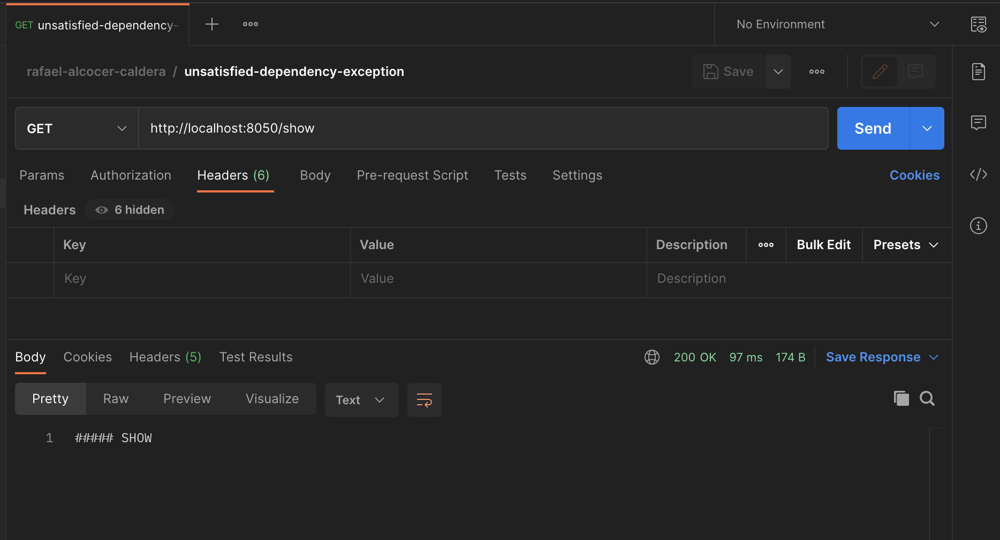

# SPRING BOOT unsatisfied dependency exception

## Synopsis

The project is a Spring Boot Application.

## Motivation

I wanted to do a Spring Boot Application, that shows how we can get UnsatisfiedDependencyException and how to solve it.

## Pre Requirements

Nothing


## Notes

I replaced the following code:

```java
@RestController
public class MyController {
    
    private final MyService myService;
    
    public MyController(MyService myService) {
        this.myService = myService;
    }
    
    @RequestMapping("/show")
    public String show() {
        return myService.show();
    }
}
```

With this code using lombok annotation **@RequiredArgsConstructor**.

Will create constructor receiving non-static final fields.

The annotation will not generate a constructor for the following fields:
- Initialized non-null fields
- Initialized final fields
- Static fields
- Non-final fields

```java
@RequiredArgsConstructor
@RestController
public class MyController {

    private final MyService myService;

    @RequestMapping("/show")
    public String show() {
        return myService.show();
    }
}
```

USING POSTMAN:
--------------
GET
http://localhost:8080/show


CURL:
-----
```json
curl --location 'http://localhost:8050/show'
```

Response:
---------
No response


ECLIPSE CONSOLE:
----------------
```

  .   ____          _            __ _ _
 /\\ / ___'_ __ _ _(_)_ __  __ _ \ \ \ \
( ( )\___ | '_ | '_| | '_ \/ _` | \ \ \ \
 \\/  ___)| |_)| | | | | || (_| |  ) ) ) )
  '  |____| .__|_| |_|_| |_\__, | / / / /
 =========|_|==============|___/=/_/_/_/
 :: Spring Boot ::                (v3.0.6)

255  [main] INFO  r.a.c.UnsatifiedDependencyExceptionApplication  --- Starting UnsatifiedDependencyExceptionApplication using Java 17.0.7 with PID 29924 (/Users/rac/Documents/GitHub/spring-boot-unsatisfied-dependency-exception/target/classes started by rac in /Users/rac/Documents/GitHub/spring-boot-unsatisfied-dependency-exception) 
256  [main] INFO  r.a.c.UnsatifiedDependencyExceptionApplication  --- No active profile set, falling back to 1 default profile: "default" 
633  [main] INFO  o.s.b.w.e.tomcat.TomcatWebServer  --- Tomcat initialized with port(s): 8050 (http) 
638  [main] INFO  o.a.catalina.core.StandardService  --- Starting service [Tomcat] 
638  [main] INFO  o.a.catalina.core.StandardEngine  --- Starting Servlet engine: [Apache Tomcat/10.1.8] 
682  [main] INFO  o.a.c.c.C.[Tomcat].[localhost].[/]  --- Initializing Spring embedded WebApplicationContext 
684  [main] INFO  o.s.b.w.s.c.ServletWebServerApplicationContext  --- Root WebApplicationContext: initialization completed in 406 ms 
709  [main] WARN  o.s.b.w.s.c.AnnotationConfigServletWebServerApplicationContext  --- Exception encountered during context initialization - cancelling refresh attempt: org.springframework.beans.factory.UnsatisfiedDependencyException: Error creating bean with name 'myController' defined in file [/Users/rac/Documents/GitHub/spring-boot-unsatisfied-dependency-exception/target/classes/rafael/alcocer/caldera/controller/MyController.class]: Unsatisfied dependency expressed through constructor parameter 0: No qualifying bean of type 'rafael.MyService' available: expected at least 1 bean which qualifies as autowire candidate. Dependency annotations: {} 
710  [main] INFO  o.a.catalina.core.StandardService  --- Stopping service [Tomcat] 
717  [main] INFO  o.s.b.a.l.ConditionEvaluationReportLogger  --- 

Error starting ApplicationContext. To display the condition evaluation report re-run your application with 'debug' enabled. 
727  [main] ERROR o.s.b.d.LoggingFailureAnalysisReporter  --- 

***************************
APPLICATION FAILED TO START
***************************

Description:

Parameter 0 of constructor in rafael.alcocer.caldera.controller.MyController required a bean of type 'rafael.MyService' that could not be found.


Action:

Consider defining a bean of type 'rafael.MyService' in your configuration.
 

```

The error org.springframework.beans.factory.UnsatisfiedDependencyException is because MyService and MyServiceImpl are in a package rafael.
They must be at least in rafael.alcocer.caldera, so that they can be recognized.



Changing MyService and MyServiceImpl to rafael.alcocer.caldera.service packege, we will solve the problem.




ECLIPSE CONSOLE:
----------------
```

  .   ____          _            __ _ _
 /\\ / ___'_ __ _ _(_)_ __  __ _ \ \ \ \
( ( )\___ | '_ | '_| | '_ \/ _` | \ \ \ \
 \\/  ___)| |_)| | | | | || (_| |  ) ) ) )
  '  |____| .__|_| |_|_| |_\__, | / / / /
 =========|_|==============|___/=/_/_/_/
 :: Spring Boot ::                (v3.0.6)

268  [main] INFO  r.a.c.UnsatifiedDependencyExceptionApplication  --- Starting UnsatifiedDependencyExceptionApplication using Java 17.0.7 with PID 30180 (/Users/rac/Documents/GitHub/spring-boot-unsatisfied-dependency-exception/target/classes started by rac in /Users/rac/Documents/GitHub/spring-boot-unsatisfied-dependency-exception) 
269  [main] INFO  r.a.c.UnsatifiedDependencyExceptionApplication  --- No active profile set, falling back to 1 default profile: "default" 
660  [main] INFO  o.s.b.w.e.tomcat.TomcatWebServer  --- Tomcat initialized with port(s): 8050 (http) 
665  [main] INFO  o.a.catalina.core.StandardService  --- Starting service [Tomcat] 
665  [main] INFO  o.a.catalina.core.StandardEngine  --- Starting Servlet engine: [Apache Tomcat/10.1.8] 
709  [main] INFO  o.a.c.c.C.[Tomcat].[localhost].[/]  --- Initializing Spring embedded WebApplicationContext 
710  [main] INFO  o.s.b.w.s.c.ServletWebServerApplicationContext  --- Root WebApplicationContext: initialization completed in 419 ms 
860  [main] INFO  o.s.b.w.e.tomcat.TomcatWebServer  --- Tomcat started on port(s): 8050 (http) with context path '' 
865  [main] INFO  r.a.c.UnsatifiedDependencyExceptionApplication  --- Started UnsatifiedDependencyExceptionApplication in 0.782 seconds (process running for 0.95) 


```




## License

All work is under Apache 2.0 license